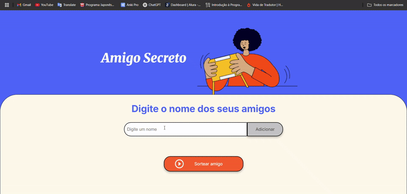

## ⭐ Sorteio de Amigo Secreto ⭐

Este é um projeto simples em JavaScript para realizar sorteios de amigo secreto sugerido pelo ONE - Alura. Ele permite adicionar participantes, sortear aleatoriamente um amigo secreto e mostrar o resultado na tela com um efeito de confetes.  

---

### 🩷 **Funcionalidades** 🩷
✔️ Adicionar amigos à lista  
✔️ Sortear um amigo secreto aleatoriamente  
✔️ Impedir sorteios com menos de 3 participantes  
✔️ Exibir o resultado na tela   

---

### ⭐ **Tecnologias Utilizadas** ⭐
- HTML
- CSS
- JavaScript  

---

### 🩷 **Como executar o Projeto** 🩷
#### 1️⃣ Clone o repositório  
```sh
https://github.com/thays-vasconcelos188/challenge-amigo-secreto-ONE
```
#### 2️⃣ Acesse a pasta do projeto  
```sh
challenge-amigo-secreto-ONE
```
#### 3️⃣ Abra o arquivo `index.html` no navegador  

---

### ⭐ **Demonstração** ⭐
## 🎥 Demonstração do Projeto

